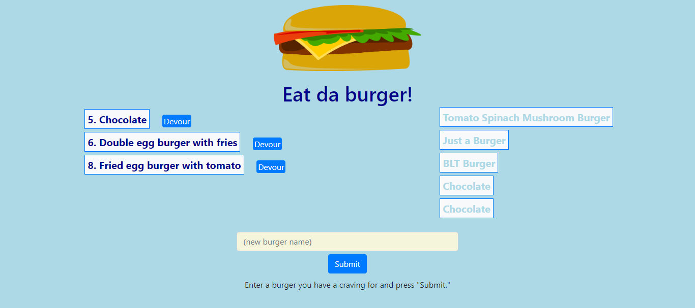

# burger
Link to Github page:   [Github Burgers](https://github.com/MauraSlavin/burger)

Link to Heroku:  [Heroku Burgers](https://git.heroku.com/floating-hamlet-11534.git)

Deployed to Heroku: [Deployed Burgers](https://floating-hamlet-11534.herokuapp.com/)

## Description
Node js application to allow users to enter a burger name.
When a new burger is entered, it is added to a list of uneaten burgers, along with a "Devour" button.
When the "Devour" button is clicked, the burger is moved to the list of eaten (devoured) burgers.

This is what the website looks like:

The list of all burgers is stored in an SQL database.

Handlebars is used to build the li's of burgers in the html file.